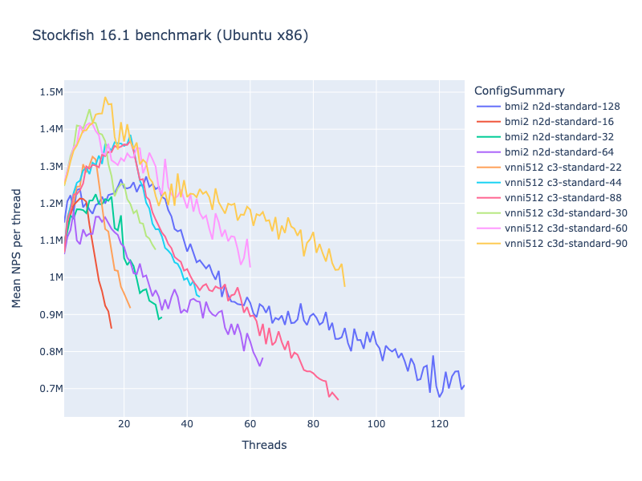
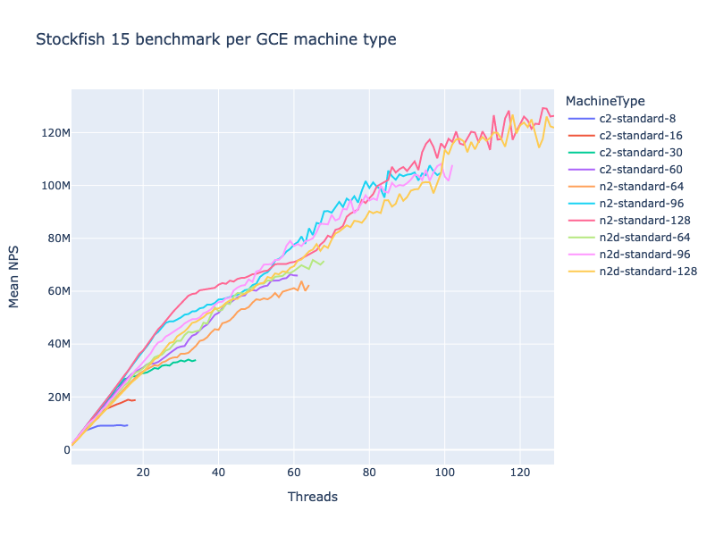
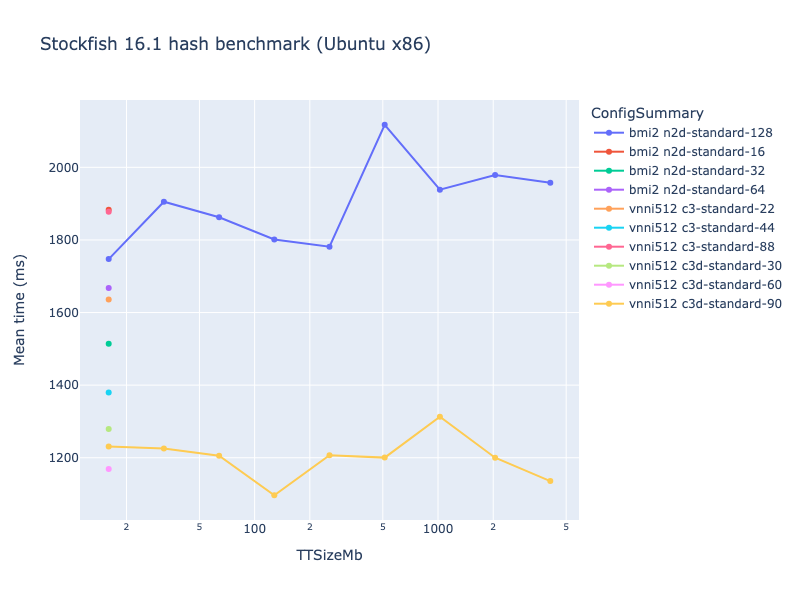

# Stockfish benchmarks

## Introduction

When deciding on a configuration for Stockfish, it's not easy to know how to
balance cost against performance. The number of [machine
types](https://cloud.google.com/compute/docs/machine-types) available on Google
Compute Engine is quite large, and different families are capable of running
different Stockfish binaries with different compiler optimisations.

There are also various parameters you can tweak, such as threads and hash size,
which the user needs to decide how to set.

To try to help with this, I ran some benchmarks to show how Stockfish search
speed increases with the number of threads, on various different machine types.

## Methodology

Stockfish has a built-in `bench` command, which runs some evaluations and then
summarises the search speed achieved in nodes per second, or _NPS_. This value
shows how many positions the engine was able to consider per second.

NPS values aren't necessarily comparable across different engines, or even
different versions of the same engine, but running the benchmark using the same
engine version with different configurations is a good way to find how to get
the best performance for that engine. See [this Chessify blog
post](https://chessify.me/blog/nps-what-are-the-nodes-per-second-in-chess-engine-analysis)
for more information about the NPS metric.

In addition to NPS, `stockfish bench` outputs the total time taken for the test,
and the number of nodes searched in the process.

The code I ran can be found in `sfbench.py`. It runs `stockfish bench`
repeatedly, first with one thread, then two threads and so on. For each thread
count, the benchmark is run three times, and the average of the three is
calculated. The code continues increasing the thread count, at least up to the
number of CPUs on the machine; it will stop when the NPS value stops increasing
(meaning we can no longer get better performance on this machine by adding more
threads).

The `sfbench.py` script also supports an option `--test_varying=ttsize`, which
increases the hash table size rather than the number of threads - again,
stopping when the increases no longer result in improved performance.

These tests were run in the `europe-west1` region in March 2024, using Stockfish
16.1 on Ubuntu 22.04 LTS. In each case I used the best Stockfish binary capable
of running on each machine type.

## Results

### Threads and machine types


Each line on this graph is a run of the benchmark on a single VM machine type.
The horizontal axis shows the number of threads; the vertical axis shows the
average NPS across the three runs for each thread count.

The "M" unit on the vertical axis is _millions_ of NPS, so for example "20M"
means 20 million NPS.

Some observations:

- The peak performance for each shape comes right around when the number of
  threads is equal to the number of CPUs the VM has: the 90-core
  `c3d-standard-90` peaks around 90 threads, the 32-core `n2d-standard-32` peaks
  around 32 threads, and so on. This is much as we would intuitively expect.
- The performance increases roughly linearly with the number of cores.
  - There is some variation between the machine types, and the effect of
    additional cores tends to drop as we move towards saturation, but the peak
    for each machine type is remarkably consistent at around 1M per core for
    `c3d` with the `vnni512` binary, and around 800k per core for `n2d` with the
    `bmi2` binary.
  - The one exception to this is the `c3` family, which did surprisingly badly
    on the benchmark, especially at higher core counts. `c3-standard-22` and
    `c3-standard-44` peaked at around 0.9 MPS per core, but `c3-standard-88`
    peaked way down at around 0.7. The NPS achieved by `c3d` was around _50%
    higher_ at peak than `c3` for the 88/90-core shapes! I found this so
    surprising that I tried it twice in separate zones, but the results were
    consistent.
  - We can see here that running a more optimised binary on a machine family
    with a more modern CPU architecture is making a significant difference. This
    can be clearly seen if we look at the same data on a per-thread basis (with
    each series truncated at the CPU count):



The raw data is in this folder as `sfbench.csv`, so you can get an interactive
version of the
[Plotly](https://plotly.com/python/line-charts/#line-plots-with-plotlyexpress)
graph by running the following from the root of the repo (requires Python 3 and
`pipenv`):

```
pipenv install --dev
pipenv shell
cd stockfish/benchmarks
jupyter lab
```

Then, run the following code in a notebook.

First, to build the data:

```python
import pandas as pd
import plotly.express as px

df = pd.read_csv('sfbench.csv')

group_cols = [
    'StockfishBinary',
    'StockfishVersion',
    'MachineType',
    'Threads',
    'CpuProcessors',
    'TTSizeMb',
    # 'InstanceID',
]
summary_cols = [
    'MachineType',
    # 'InstanceID',
]

mean_nps = df.groupby(group_cols)['NPS'].mean().reset_index()
def config_summary(row):
    parts = [row['StockfishBinary'].rsplit('-', maxsplit=1)[-1]]
    parts.extend(str(row[col]) for col in summary_cols)
    return ' '.join(parts)
mean_nps['ConfigSummary'] = mean_nps.apply(config_summary, axis=1)
mean_nps['NPSPerThread'] = mean_nps.apply(lambda r: r['NPS'] / r['Threads'], axis=1)
```

Then, to plot it:

```python
# Just use the data with the fixed default hash size
threads_nps = mean_nps[mean_nps['TTSizeMb'] == 16]
fig = px.line(threads_nps, x='Threads', y='NPS', color='ConfigSummary',
             title='Stockfish 16.1 benchmark (Ubuntu x86)', width=800, height=600)
fig.update_layout(yaxis_title='Mean NPS')
fig.show()

fig = px.line(threads_nps[threads_nps['Threads'] <= threads_nps['CpuProcessors']],
             x='Threads', y='NPSPerThread', color='ConfigSummary',
             title='Stockfish 16.1 benchmark (Ubuntu x86)', width=800, height=600)
fig.update_layout(yaxis_title='Mean NPS per thread')
fig.show()
```

A previous version of this benchmark run with Stockfish 15 may be found below.
Interestingly, the NPS values for the older Stockfish 15 are significantly
higher.

It's possible the benchmark is different between the two versions, but my
experience using the engines suggests that NPS is simply lower in Stockfish 16.1
compared to Stockfish 15 (which is entirely compatible with 16.1 having a
greater playing strength).



### Hash size

The `sfbench.py` script also supports an option `--test_varying=ttsize`, which
varies the size of the transposition table instead of the number of threads.

I ran this on a couple of machine types, and the results show increasing
`TTSizeMb` has essentially no effect on the mean NPS. This is perhaps not
surprising, as my intuition would be that transposition tables should have
little effect on the rate at which nodes can be searched. Rather, by avoiding
repeated evaluation of more nodes, a larger hash would increase the depth the
search can reach in a fixed amount of time -- or, equivalently, reduce the
amount of time required for the search to reach a given depth.

However, graphing `TotalTimeMS` against `TTSizeMb` also shows no clear
relationship:

```python
mean_time = df.groupby(group_cols)['TotalTimeMS'].mean().reset_index()
mean_time['ConfigSummary'] = mean_time.apply(config_summary, axis=1)
hash_time = mean_time[mean_time['Threads'] == mean_time['CpuProcessors']]
fig = px.line(hash_time, x='TTSizeMb', y='TotalTimeMS', color='ConfigSummary',
             title='Stockfish 16.1 hash benchmark (Ubuntu x86)', width=800, height=600, log_x=True, markers=True)
fig.update_layout(yaxis_title='Mean time (ms)')
fig.show()
```



## Conclusions

- Stockfish's `Threads` parameter should be set to around the same number of CPU
  cores you have on your VM. For example, if running on `c2-standard-8`, use 8
  threads.
- By doing this, you should get roughly 0.8 MNPS of search speed per core with
  `n2d` and the `bmi2` binary, and roughly 1.0 MNPS with `c3d` and the `vnni512`
  binary. The `c3` family seems to result in much lower incremental benefits
  from higher core counts past a certain point.
- The hash size does not appear to affect any of the test metrics. I am not sure
  why this might be.
