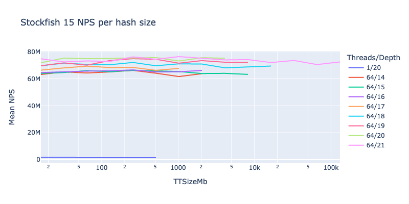
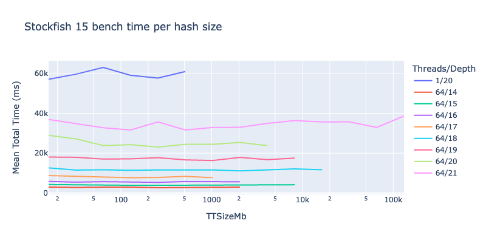
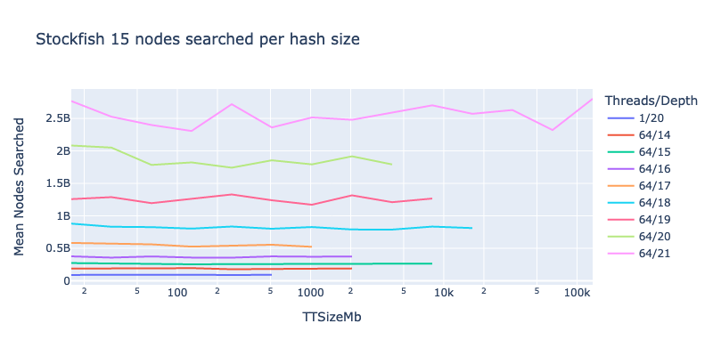

# Stockfish benchmarks

## Introduction

When deciding on a configuration for Stockfish, it's not easy to know how to
balance cost against performance. The number of [machine
types](https://cloud.google.com/compute/docs/machine-types) available on Google
Compute Engine is quite large.

There are also various parameters you can tweak, such as threads and hash size,
which the user needs to decide how to set.

To try to help with this, I ran some benchmarks to show how Stockfish search
speed increases with the number of threads, on various different machine types.
I also looked at the influence of hash table size, on a single machine type.

## Methodology

Stockfish has a built-in `bench` command, which runs some evaluations and then
summarises the search speed achieved in nodes per second, or *NPS*. This value
shows how many positions the engine was able to consider per second.

NPS values aren't necessarily comparable across different engines, or even
different versions of the same engine, but running the benchmark using the same
engine version with different configurations is a good way to find how to get
the best performance for that engine. See [this Chessify blog
post](https://chessify.me/blog/nps-what-are-the-nodes-per-second-in-chess-engine-analysis)
for more information about the NPS metric.

In addition to NPS, `stockfish bench` outputs the total time taken for the test,
and the number of nodes searched in the process.

The code I ran can be found in `sfbench.py`. It runs `stockfish bench`
repeatedly, first with one thread, then two threads and so on. For each thread
count, the benchmark is run three times, and the average of the three is
calculated. The code continues increasing the thread count, at least up to the
number of CPUs on the machine; it will stop when the NPS value stops increasing
(meaning we can no longer get better performance on this machine by adding more
threads).

The `sfbench.py` script also supports an option `--test_varying=ttsize`, which
increases the hash table size rather than the number of threads - again,
stopping when the increases no longer result in improved performance.

These tests were run in the `europe-west1` region in late April and early May
2022, using `stockfish_15_linux_x64_bmi2` on Ubuntu 22.04 LTS.

## Results

### Threads and machine types


Each line on this graph is a run of the benchmark on a single VM. The horizontal
axis shows the number of threads; the vertical axis shows the average NPS across
the three runs for each thread count.

The "M" unit on the vertical axis is *millions* of NPS, so for example "20M"
means 20 million NPS. For comparison, the best performance I can get on my
(fairly old) laptop is just below 5M.

Some observations:

* The peak performance for each shape comes right around when the number of
  threads is equal to the number of CPUs the VM has: the 8-core `c2-standard-8`
  peaks around 8 threads, the 16-core `c2-standard-16` peaks around 16 threads,
  and so on. This is much as we would intuitively expect.
* The performance increases roughly linearly with the number of cores.
  * There is some variation between the machine types, and the effect of
    additional cores tends to drop as we move towards saturation, but the peak
    for each machine type is remarkably consistent at around 1M to 1.2M per
    core: the 8-core peaks around 9M, the 16-core around 19M, the 30-core around
    33M, the 60-core around 65M and so on.
  * If you want to breach that magic 100M barrier, you have to go to 96 or 128
    cores. I didn't try shapes larger than 128 cores; the 128-core ones peaked
    around 128M.
  * As a sanity check, we can compare these numbers to what Stockfish 15
    achieved in [the TCEC Season 22
    Superfinal](https://tcec-chess.com/#div=sf&game=1&season=22); if you click
    into games and then the "Speed" graph, you see that speeds around the 70-90
    MNPS range are common, so we are in roughly the right ballpark here.
  * From hovering over the kings next to the engine names, you can see Stockfish
    used 101 threads in that match; I believe [the system
    used](https://wiki.chessdom.org/TCEC_Season_Further_information#TCEC_all_in_one_box_server_since_after_S21_superfinal)
    was 52-core with hyperthreading, which may explain the slightly lower
    performance per core.
* The type of CPU doesn't make a huge difference. There aren't sufficiently
  clear and consistent variations between, say, the Intel-based `n2` shapes and
  the AMD `n2d` ones that would make me say one is clearly better than the
  other. More in-depth testing on more different VMs would probably be needed to
  determine whether there are statistically significant differences. Each of the
  lines on the graph is from a single VM; some luck is involved in where the VM
  is placed, for example `n2` VMs can get either Cascade Lake or Ice Lake CPUs.

The raw data is in this folder as `sfbench.csv`, so you can get an interactive
version of the
[Plotly](https://plotly.com/python/line-charts/#line-plots-with-plotlyexpress)
graph by running the following from the root of the repo (requires Python 3 and
`pipenv`):

```
pipenv install --dev
pipenv shell
jupyter lab
```

Then, run the following code in a notebook in the `stockfish/benchmarks` folder:

```python
import pandas as pd
import plotly.express as px

df = pd.read_csv('sfbench.csv')
fig = px.line(df, x='Threads', y='MeanNPS', color='MachineType',
              title='Stockfish 15 benchmark per GCE machine type',
              width=800, height=600)
fig.update_layout(yaxis_title='Mean NPS')
fig.show()
```

### Hash size

The Stockfish documentation [does not provide clear
guidance](https://github.com/official-stockfish/Stockfish/discussions/3333) on
how to set the hash size. In theory, bigger should be better, but it is not that
simple, as larger hashes could cause the table to spill into slower layers of
the [memory hierarchy](https://en.wikipedia.org/wiki/Memory_hierarchy), as
[noted
here](https://github.com/official-stockfish/Stockfish/issues/2082#issuecomment-683280714).

I tried using `sfbench.py` with `--test_varying=ttsize` to see what effect the
hash size parameter has on the benchmark performance. I was surprised to find
the answer was almost nothing. I ran my tests on a `n2-standard-64` machine,
which has 256Gb RAM; the test started with the default 16Mb hash, and doubled
this on each run, but gave up trying to achieve any improvement when it reached
2Gb, far below the memory available on the machine.

I tried tweaking various parameters to see if I could find a combination where
the hash size had some sort of effect, but I couldn't find one.

* I tried increasing the search depth, from 14 up to 21, on the basis that maybe
  higher depths would increase the number of positions searched and create more
  benefit from a larger hash, but it did not help.
* At depth 21, I even tried `--max_failures_to_improve=5` to force the script to
  keep trying more larger hash values despite not seeing any performance
  improvement, and it went right to 128Gb (the benchmark failed outright with
  256Gb); still no meaningful effect.
* I also tried with just one thread, rather than 64, since [this
  comment](https://github.com/official-stockfish/Stockfish/issues/2082#issuecomment-683280714)
  suggested hash would have some effect on the benchmark in that case, but it
  really didn't seem to.

I thought perhaps hash size might not affect NPS, since the test might not count
nodes the engine didn't have to search due to hash table hits, but perhaps it
might have an effect on other metrics, like time to complete the benchmark? But
I looked at all three metrics output by the test, and hash size did not seem to
yield meaningful improvement in any of them.







I'm not really sure what to conclude from this. In TCEC Season 22, it seems
Stockfish 15 used a hash of 98304 Mb (96 Gb), which [seems to
be](https://wiki.chessdom.org/TCEC_Season_Further_information#TCEC_all_in_one_box_server_since_after_S21_superfinal)
the exact amount allocated to the engine, so clearly the developers believe it
is worth using a large hash.

[This
comment](https://github.com/official-stockfish/Stockfish/discussions/3333#discussioncomment-394041)
suggests there are ways to see Stockfish's hash usage statistics, which might
shed some light on what is happening, but I could not find any such information
in the `bench` output.

Possibly the hash size makes a difference to engine performance in ways the
benchmark can't pick up. The acid test would be to run a lengthy match between
engines on identical hardware with identical configurations except for hash
size. [This
comment](https://github.com/official-stockfish/Stockfish/issues/2082#issuecomment-683233523)
suggests that a TCEC match was run between a Stockfish with a 64Gb hash and one
with a 128Gb hash, but there only appear to have been two games, both drawn, and
the log metrics discussed later in the thread don't seem to suggest there is a
huge difference between these configurations.

Another possibility is that hash size only starts to make a difference at even
higher depths, though that would raise the question of why the default benchmark
depth is just 13.

I can only (tentatively) conclude that hash size simply doesn't matter much. It
can probably just be left at the default size and not worried about too much.

The hash test results are in `sfhash.csv`. Here is the code used to generate the
graphs:

```python
import pandas as pd
import plotly.express as px

df = pd.read_csv('sfhash.csv')
df = df.sort_values(by=['Threads', 'Depth'])
df['ThreadsDepth'] = df.apply(lambda row: f'{row.Threads}/{row.Depth}', axis=1)

fig = px.line(df, x='TTSizeMb', y='MeanNPS', color='ThreadsDepth',
              title='Stockfish 15 NPS per hash size',
              log_x=True,
              width=800, height=400)
fig.update_layout(yaxis_title='Mean NPS', legend_title_text='Threads/Depth')
fig.show()

fig = px.line(df, x='TTSizeMb', y='MeanTotalTimeMS', color='ThreadsDepth',
              title='Stockfish 15 bench time per hash size',
              log_x=True,
              width=800, height=400)
fig.update_layout(yaxis_title='Mean Total Time (ms)', legend_title_text='Threads/Depth')
fig.show()

fig = px.line(df, x='TTSizeMb', y='MeanNodesSearched', color='ThreadsDepth',
              title='Stockfish 15 nodes searched per hash size',
              log_x=True,
              width=800, height=400)
fig.update_layout(yaxis_title='Mean Nodes Searched', legend_title_text='Threads/Depth')
fig.show()
```

## Conclusions

* Stockfish's `Threads` parameter should be set to around the same number of CPU
  cores you have on your VM. For example, if running on `c2-standard-8`, use 8
  threads.
* By doing this, you should get roughly 1.0 to 1.2 MNPS of search speed per
  core.
* Other factors, such as the CPU family, don't seem to make nearly as large a
  difference (at least among `c2`, `n2` and `n2d`), so it probably makes sense
  to just go for whichever one is cheapest on a per-core basis.
* The `Hash` size really doesn't seem to make too much difference to the
  benchmark results. This raises the possibility that using a `highcpu` shape
  might be more economical than a `standard` one, since having less RAM with the
  same number of cores would reduce the cost, without (seemingly) having much
  negative effect on performance.
