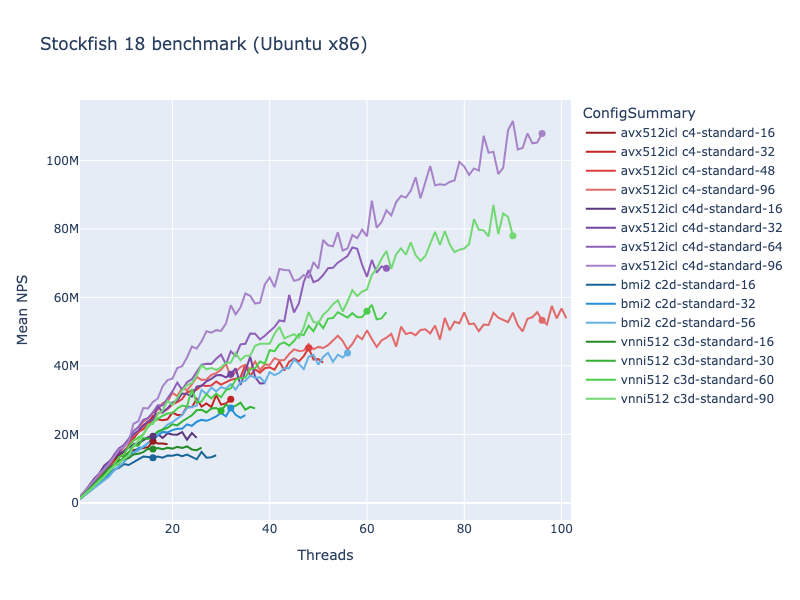
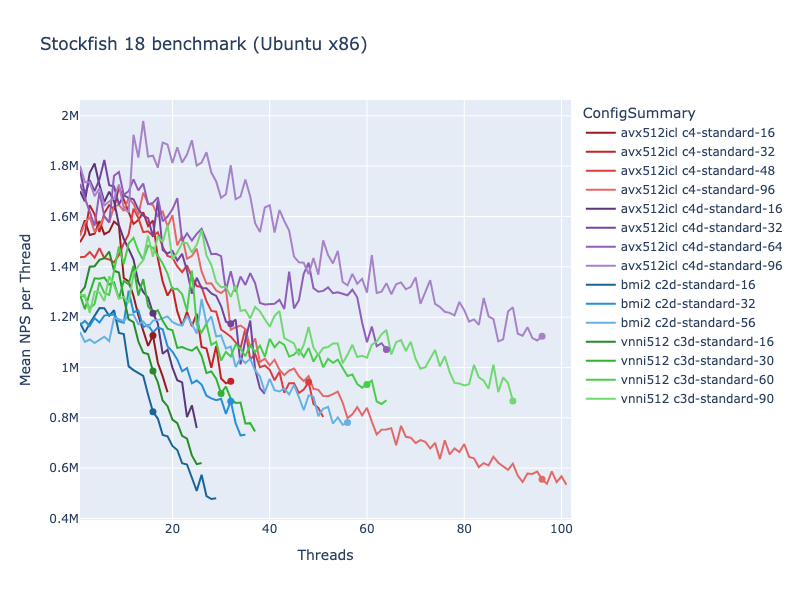
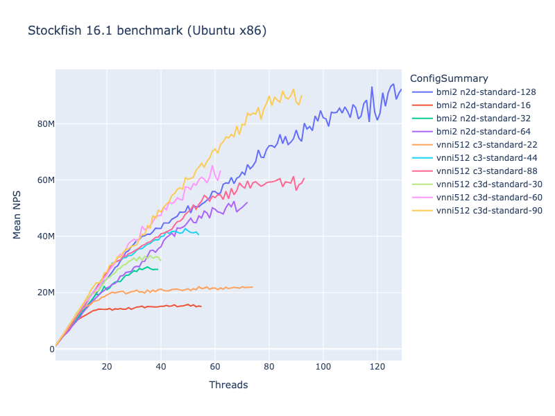
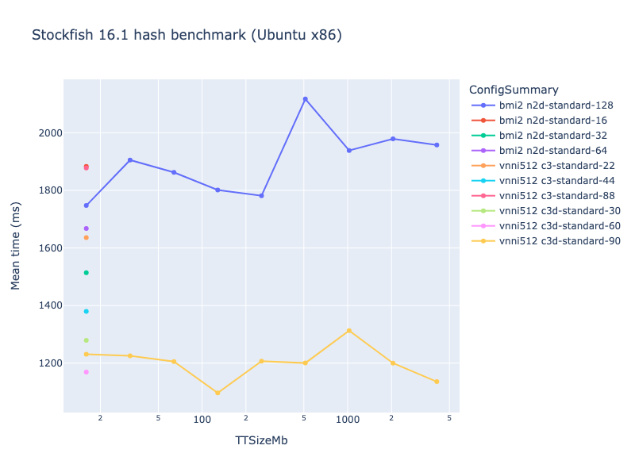
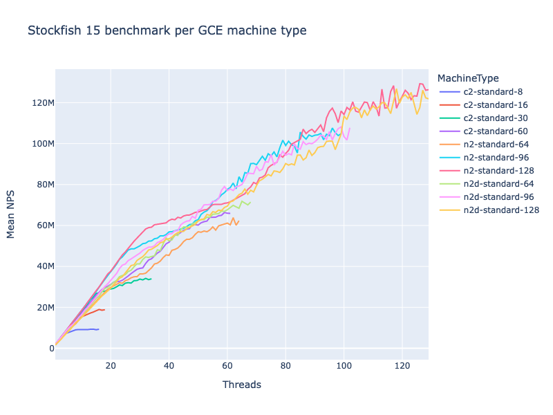

# Stockfish benchmarks

## Introduction

When deciding on a configuration for Stockfish, it's not easy to know how to
balance cost against performance. The number of [machine
types](https://cloud.google.com/compute/docs/machine-types) available on Google
Compute Engine is quite large, and different families are capable of running
different Stockfish binaries with different compiler optimisations.

There are also various parameters you can tweak, such as threads and hash size,
which the user needs to decide how to set.

To try to help with this, I ran some benchmarks to show how Stockfish search
speed increases with the number of threads, on various different machine types.

## Methodology

Stockfish has a built-in `bench` command, which runs some evaluations and then
summarises the search speed achieved in nodes per second, or _NPS_. This value
shows how many positions the engine was able to consider per second.

NPS values aren't necessarily comparable across different engines, or even
different versions of the same engine, but running the benchmark using the same
engine version with different configurations is a good way to find how to get
the best performance for that engine. See [this Chessify blog
post](https://chessify.me/blog/nps-what-are-the-nodes-per-second-in-chess-engine-analysis)
for more information about the NPS metric.

In addition to NPS, `stockfish bench` outputs the total time taken for the test,
and the number of nodes searched in the process.

The code I ran can be found in `sfbench.py`. It runs `stockfish bench`
repeatedly, first with one thread, then two threads and so on. For each thread
count, the benchmark is run three times, and the average of the three is
calculated. The code continues increasing the thread count, at least up to the
number of CPUs on the machine; it will stop when the NPS value stops increasing
(meaning we can no longer get better performance on this machine by adding more
threads).

The `sfbench.py` script also supports an option `--test_varying=ttsize`, which
increases the hash table size rather than the number of threads - again,
stopping when the increases no longer result in improved performance.

The script `sfbench_multi.py` launches `sfbench.py` concurrently across a
predefined set of VM machine types and Stockfish binaries, outputting the
results to a specified folder, from which they can then be aggregated.

I have collected various runs of this benchmark at various different times in
`sfbench.csv`.

## Results

### Threads and machine types



Each line on this graph is a run of the benchmark on a single VM machine type.
The horizontal axis shows the number of threads; the vertical axis shows the
average NPS across the three runs for each thread count. The marker on each line
is where the number of threads was equal to the number of cores on the machine.

The "M" unit on the vertical axis is _millions_ of NPS, so for example "20M"
means 20 million NPS.

Some observations:

- The peak performance for each shape comes right around when the number of
  threads is equal to the number of CPUs the VM has. This is much as we would
  intuitively expect.
- The performance increases roughly linearly with the number of cores.
  - There is some variation between the machine types, and the effect of
    additional cores tends to drop as we move towards saturation.
  - The `c4` family did surprisingly badly on the benchmark, worse than `c3d`
    from the previous generation.
  - We can see here that running a more optimised binary on a machine family
    with a more modern CPU architecture is making a significant difference.

Looking at these results on a per-thread basis is also interesting:



## Conclusions

- Stockfish's `Threads` parameter should be set to around the same number of CPU
  cores you have on your VM. For example, if running on `c2-standard-8`, use 8
  threads.
- By doing this, you should get at least 1 MNPS of search speed per core with
  `c4d` and the `avx512icl` binary.

## Older results

### Stockfish 16.1



The `sfbench.py` script also supports an option `--test_varying=ttsize`, which
varies the size of the transposition table instead of the number of threads.

I ran this on a couple of machine types, and the results show increasing
`TTSizeMb` has essentially no effect on the mean NPS. This is perhaps not
surprising, as my intuition would be that transposition tables should have
little effect on the rate at which nodes can be searched. Rather, by avoiding
repeated evaluation of more nodes, a larger hash would increase the depth the
search can reach in a fixed amount of time -- or, equivalently, reduce the
amount of time required for the search to reach a given depth.

However, graphing `TotalTimeMS` against `TTSizeMb` also shows no clear
relationship:



Overall, the hash size seems to have very little effect on the test metrics.

### Stockfish 15



The higher overall NPS values for this older (and weaker) engine show that
higher NPS values do not necessarily indicate greater playing strength.

## Generating the graphs

I have included a Jupyter notebook `sfbench.ipynb` showing how the graphs were
generated.

To open up the Jupyter lab environment:

```
pipenv install --dev
pipenv shell
cd stockfish/benchmarks
jupyter lab
```

Alternatively, you can open up the notebook in VSCode or some other editor which
supports Jupyter notebooks natively.
