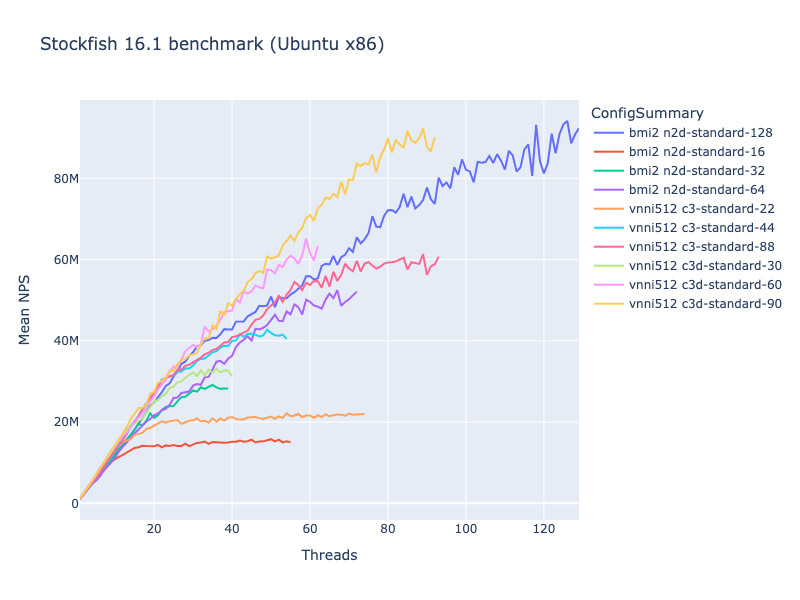

# Stockfish benchmarks

## Introduction

When deciding on a configuration for Stockfish, it's not easy to know how to
balance cost against performance. The number of [machine
types](https://cloud.google.com/compute/docs/machine-types) available on Google
Compute Engine is quite large.

To try to help with this, I ran some benchmarks to show how Stockfish search
speed increases with the number of threads, on various different machine types.

## Methodology

Stockfish has a built-in `bench` command, which runs some evaluations and then
summarises the search speed achieved in nodes per second, or *NPS*. This value
shows how many positions the engine was able to consider per second.

NPS values aren't necessarily comparable across different engines or engine versions, but
running the benchmark using the same engine version with different
configurations is a good way to find how to get the best performance for that
engine. See [this Chessify blog
post](https://chessify.me/blog/nps-what-are-the-nodes-per-second-in-chess-engine-analysis)
for more information about the NPS metric.

The code I ran can be found in `sfbench.py`. It runs `stockfish bench`
repeatedly, first with one thread, then two threads and so on. For each thread
count, the benchmark is run three times, and the average of the three is
calculated. The code continues increasing the thread count, at least up to the
number of CPUs on the machine; it will stop when the NPS value stops increasing
(meaning we can no longer get better performance on this machine by adding more
threads).

These tests were run in the `europe-west1` region in late April 2022, using
`stockfish_15_linux_x64_bmi2` on Ubuntu 22.04 LTS.

## Results



Each line on this graph is a run of the benchmark on a single VM. The horizontal
axis shows the number of threads; the vertical axis shows the average NPS across
the three runs for each thread count.

The "M" unit on the vertical axis is *millions* of NPS, so for example "20M"
means 20 million NPS. For comparison, the best performance I can get on my
(fairly old) laptop is just below 5M.

Some observations:

* The peak performance for each shape comes right around when the number of
  threads is equal to the number of CPUs the VM has: the 8-core `c2-standard-8`
  peaks around 8 threads, the 16-core `c2-standard-16` peaks around 16 threads,
  and so on. This is much as we would intuitively expect.
* The performance increases roughly linearly with the number of cores. There is
  some variation between the machine types, and the effect of additional cores
  tends to drop as we move towards saturation, but the peak for each machine
  type is remarkably consistent at around 1M to 1.2M per core: the 8-core peaks
  around 9M, the 16-core around 19M, the 30-core around 33M, the 60-core around
  65M and so on. If you want to breach that magic 100M barrier, you have to go
  to 96 or 128 cores. I didn't try shapes larger than 128 cores; the 128-core
  ones peaked around 128M.
* The type of CPU doesn't make a huge difference. There aren't sufficiently
  clear and consistent variations between, say, the Intel-based `n2` shapes and
  the AMD `n2d` ones that would make me say one is clearly better than the
  other. More in-depth testing on more different VMs would probably be needed to
  determine whether there are statistically significant differences. Each of the
  lines on the graph is from a single VM; some luck is involved in where the VM
  is placed, for example `n2` VMs can get either Cascade Lake or Ice Lake CPUs.

The raw data is in this folder as `sfbench.csv`, so you can get an interactive
version of the
[Plotly](https://plotly.com/python/line-charts/#line-plots-with-plotlyexpress)
graph by running the following from the root of the repo (requires Python 3 and
`pipenv`):

```
pipenv install --dev
pipenv shell
jupyter lab stockfish/benchmarks/sfbench.ipynb
```

## Conclusions

* Stockfish's `Threads` parameter should be set to around the same number of CPU
  cores you have on your VM. For example, if running on `c2-standard-8`, use 8
  threads.
* By doing this, you should get roughly 1.0 to 1.2 MNPS of search speed per
  core.
* Other factors, such as the CPU family, don't seem to make nearly as large a
  difference (at least among `c2`, `n2` and `n2d`), so it probably makes sense
  to just go for whichever one is cheapest on a per-core basis.
